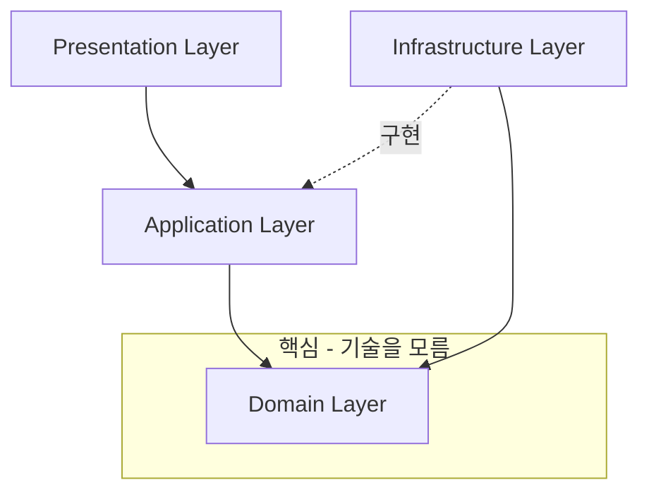
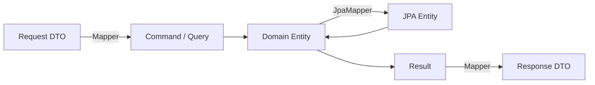
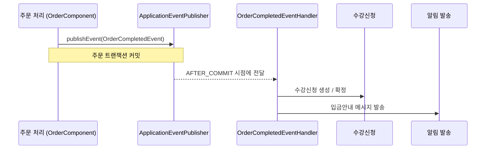

* toc
{:toc .large-only}

# BlerOn 서비스 Backend 프로젝트 구조

이 글은 내가 BlerOn 서비스의 Admin Backend를 만들면서 어떤 고민을 했고, 왜 지금과 같은 프로젝트 구조를 선택하게 되었는지를 정리한 회고에 가깝다.
"정답"을 말하려는 글은 아니다. 운영 인력이 넉넉하지 않은 환경에서, 나름대로 현실과 이상 사이에서 타협하며 만든 구조에 대한 기록이다.

처음 프로젝트를 시작할 때 가장 크게 했던 고민은 두 가지였다.

- 도메인 비즈니스 로직을 **한 곳에서 관리**하고 싶다. 사람이 많지 않으니, 비즈니스 규칙이 여기저기 흩어지면 결국 아무도 전체를 파악하지 못하게 된다.
- 지금은 모놀리식이지만, 언젠가 트래픽이나 조직이 커지면 **MSA로 쪼갤 수 있는 여지**를 남겨두고 싶다. 그러려면 계층 간, 도메인 간 결합을 최대한 느슨하게 가져가야 한다.

그래서 선택한 것이 **DDD + Hexagonal Architecture + Event Driven**의 조합이었다.

---

## 개요

기술 스택부터 간단히 정리하면 아래와 같다.

| 항목 | 내용 |
| --- | --- |
| 언어 / 프레임워크 | Java 21, Spring Boot 3.3.4 |
| 영속성 | Spring Data JPA / Hibernate, MariaDB·MySQL |
| 캐시 / 락 | Redis (Redisson), Caffeine, ShedLock |
| 인증 | Spring Security + JWT (jjwt 0.12.6) |
| 아키텍처 | DDD + CQRS + Hexagonal + Event Driven |

핵심은 마지막 줄이다. 단순히 Controller-Service-Repository로 쌓는 전통적인 레이어드 구조 대신,
도메인을 중심에 두고 그 바깥을 기술이 감싸는 형태를 택했다.

---

## 이 구조를 만들게 된 이유

솔직히 처음부터 "Hexagonal을 해야지!"라고 시작한 건 아니었다.
오히려 운영을 하면서 겪은 불편함이 구조를 이런 방향으로 밀어붙였다고 보는 게 맞다.

**첫째, 비즈니스 로직을 한 군데로 모으고 싶었다.**
사람이 적은 팀에서는 "이 계산 로직이 Controller에 있던가, Service에 있던가, 아니면 쿼리에 녹아 있던가?"를 매번 찾는 시간이 곧 비용이다.
그래서 비즈니스 규칙은 무조건 도메인 엔티티(또는 도메인 서비스)에 두기로 했다. 도메인 객체만 보면 "이 도메인이 무엇을 할 수 있는지"가 드러나도록 만들고 싶었다.

**둘째, 확장(MSA)을 염두에 두었다.**
당장 쪼갤 계획은 없어도, 도메인 간 호출이 메서드 직접 호출로 빽빽하게 엮여 있으면 나중에 절대 못 쪼갠다.
그래서 도메인 사이의 소통은 가능하면 **이벤트**로 흘려보내, 서로의 내부를 모르게 만들었다.

**셋째, 계층 간·도메인 간 강결합을 없애고 싶었다.**
도메인이 JPA나 외부 API 같은 "기술"에 직접 의존하면, 기술을 바꾸는 순간 도메인까지 흔들린다.
그래서 도메인은 인터페이스(Port)만 바라보고, 실제 기술 구현(Adapter)은 바깥 계층으로 밀어냈다.

이 세 가지가 각각 DDD, Event Driven, Hexagonal로 이어졌다.

---

## 전체 패키지 구조

패키지는 크게 네 개의 계층으로 나눴다.

```
kr.co.bler/
├── presentation/      # HTTP 요청/응답 (Controller, Request/Response DTO, Mapper)
├── application/       # 유스케이스 조율 (Command/Query, Result, Service, Handler, Gateway)
│   ├── command/       # 쓰기 요청 (CQRS - Command)
│   ├── query/         # 읽기 요청 (CQRS - Query)
│   ├── result/        # 애플리케이션 반환 객체
│   ├── service/       # 유스케이스 구현체
│   ├── handler/       # 도메인 이벤트 핸들러 (구독자)
│   └── gateway/       # 외부 연동 추상화 (Port)
├── domain/            # 핵심 비즈니스 (Entity, Repository 인터페이스, Service, Event)
│   ├── {도메인}/entity/
│   ├── {도메인}/repository/   # 리포지토리 인터페이스 (Port)
│   ├── {도메인}/event/        # 도메인 이벤트
│   └── shared/                # 공유 커널 (예외 등)
└── infrastructure/    # 기술 세부사항 (JPA, 외부 클라이언트, 설정)
    ├── persistence/   # JPA Entity, Repository 구현체(Adapter), JpaMapper
    ├── client/        # 외부 API 클라이언트 (Adapter)
    ├── security/      # JWT, Spring Security
    └── config/        # 각종 설정
```

여기서 가장 중요한 규칙은 **의존성의 방향**이다.
바깥(infrastructure)은 안쪽(domain)을 알아도 되지만, 안쪽은 절대 바깥을 몰라야 한다.



`domain` 패키지를 열어 보면 Spring이나 JPA에 의존하는 코드가 거의 없다.
도메인은 "무엇을 할 것인가"만 알고, "어떻게(어떤 기술로) 할 것인가"는 모른다. 이게 이 구조의 출발점이다.

---

## Hexagonal Architecture 관점 - Port와 Adapter

Hexagonal에서 가장 핵심이 되는 개념은 **Port(구멍)** 와 **Adapter(어댑터)** 다.
도메인은 벽에 "이런 기능이 필요해"라는 구멍(인터페이스)만 뚫어두고, 그 구멍에 실제 부품을 꽂는 일은 바깥 계층이 한다.

처음 이 개념을 적용할 때는 "인터페이스를 굳이 이렇게 나눠야 하나?" 싶었는데,
막상 DB 접근 방식이나 외부 스토리지를 바꿔야 할 일이 생기니 진가가 드러났다. 도메인은 한 줄도 안 고쳐도 됐다.

### Port 1. 영속성 - 도메인 리포지토리 인터페이스

도메인 계층에는 "저장하고 조회한다"는 **약속**만 인터페이스로 둔다. JPA의 J자도 보이지 않는다.

```12:54:src/main/java/kr/co/bler/domain/businessinquiry/repository/BusinessInquiryRepository.java
/** 기업 문의 리포지토리 */
public interface BusinessInquiryRepository {

    /**
     * 기업 문의 저장
     *
     * @param businessInquiry 기업 문의 도메인
     * @return 저장된 기업 문의 도메인
     */
    BusinessInquiryDomain save(BusinessInquiryDomain businessInquiry);

    /**
     * 기업 문의 고유번호로 조회
     *
     * @param businessInquirySeq 기업 문의 고유번호
     * @return 기업 문의 도메인
     */
    Optional<BusinessInquiryDomain> findByBusinessInquirySeq(Long businessInquirySeq);

    // ... 목록 조회 등
}
```

그리고 이 인터페이스의 실제 구현(Adapter)은 `infrastructure` 계층의 `...RepositoryImpl`에 둔다.
JPA, QueryDSL, 네이티브 쿼리 무엇을 쓰든 그건 어댑터 안의 사정이고, 도메인은 알 필요가 없다.

### Port 2. 외부 연동 - Gateway

외부 시스템(SMS, 클라우드 스토리지, SNS 인증 등)도 똑같다.
애플리케이션 계층에 `gateway` 패키지를 만들어 "외부와 이런 식으로 대화한다"는 인터페이스만 정의했다.

```7:28:src/main/java/kr/co/bler/application/gateway/SmsGateway.java
/**
 * SMS 발송 게이트웨이 스펙
 * - 애플리케이션 레이어에서 외부 SMS API 연동 기능을 추상화
 */
public interface SmsGateway {

    /**
     * SMS 발송
     *
     * @param from 발신자 번호
     * @param to 수신자 번호
     * @param text 발송 메시지
     * @return 발송 결과 (성공 시 msgKey 반환)
     */
    SmsSendResult sendSms(String from, String to, String text);

    // ...
}
```

클라우드 스토리지도 마찬가지로 `CloudStorageGateway` 인터페이스만 보고 코드를 작성한다.
실제로 S3를 쓰든 KT Cloud Object Storage를 쓰든, 그건 `infrastructure/client` 쪽 어댑터가 책임진다.
덕분에 "스토리지 업체를 바꾸자"는 이야기가 나와도 비즈니스 코드는 건드릴 일이 없다.

정리하면 Port/Adapter 분리는 이렇게 매핑된다.

| 구분 | Port (인터페이스, 안쪽) | Adapter (구현체, 바깥쪽) |
| --- | --- | --- |
| 영속성 | `domain/{도메인}/repository/...Repository` | `infrastructure/persistence/repository/...RepositoryImpl` |
| 외부 연동 | `application/gateway/...Gateway` | `infrastructure/client/...` |

---

## DDD 관점 - 도메인을 중심에 두기

### 4계층과 CQRS

앞서 본 4계층 위에, 읽기와 쓰기를 분리하는 **CQRS**를 얹었다.
같은 도메인이라도 "변경"과 "조회"는 관심사가 완전히 다르기 때문이다.

- `application/command` : 상태를 바꾸는 요청 (`CreateXxxCommand`, `UpdateXxxCommand`, `DeleteXxxCommand`)
- `application/query` : 조회 요청 (`GetXxxQuery`, `GetXxxListQuery`)
- `application/result` : 서비스가 돌려주는 결과 객체

쓰기는 도메인 규칙을 충실히 태우고, 읽기는 화면에 필요한 데이터를 빠르게 뽑는 데 집중한다.
이렇게 나누고 나니 "조회 성능 때문에 도메인 로직이 오염되는" 흔한 문제가 많이 줄었다.

### 데이터가 흐르는 모양

요청 하나가 들어오면 객체가 계층을 따라 이렇게 모습을 바꾼다.



여기서 의도적으로 지킨 규칙이 하나 있다. **JPA Entity는 절대 infrastructure 밖으로 내보내지 않는다.**
조회할 때는 `JpaMapper`가 JPA Entity를 도메인 객체로 바꿔서 올려보내고, 저장할 때는 반대로 내려보낸다.
번거로워 보여도, 이 한 겹의 변환 덕분에 "DB 스키마가 도메인을 침범하는" 일을 막을 수 있었다.

### 비즈니스 로직은 도메인 안에

비즈니스 규칙은 Service가 아니라 도메인 객체가 직접 들고 있게 했다.
예를 들어 주문이 추천인을 가졌는지 같은 판단은 `OrderDomain.hasMentorMasterSeq()`처럼 도메인이 스스로 답한다.

```142:147:src/main/java/kr/co/bler/application/handler/order/OrderCompletedEventHandler.java
        // 추천인정보 식별
        boolean existMentor = orderDomain.hasMentorMasterSeq();
        boolean existLecturer = learner != null && learner.hasRecommendLecturer();
        if (!existMentor && !existLecturer) {
            log.debug("추천인 정보 없음 memberMaster={} | orderId={} ", memberMasterSeq, orderId);
            return;
        }
```

여러 도메인이 함께 얽히는 로직은 도메인 서비스로 빼고, 공통으로 쓰는 예외 같은 것은 `domain/shared`에 모아 두었다.

```3:11:src/main/java/kr/co/bler/domain/shared/exception/DomainException.java
public abstract class DomainException extends RuntimeException {
    public DomainException(String message) {
        super(message);
    }

    public DomainException(String message, Throwable cause) {
        super(message, cause);
    }
}
```

---

## Event Driven 관점 - 도메인 간 결합 끊어내기

도메인을 잘 나눠 놓아도, 결국 "주문이 완료되면 수강신청도 만들어야 하고, 알림도 보내야 하고…"처럼 도메인끼리 엮이는 순간이 온다.
이때 주문 서비스가 수강신청 서비스를, 또 알림 서비스를 직접 호출하기 시작하면 금세 거미줄이 된다. 나중에 도메인을 쪼개기도 불가능해진다.

그래서 도메인 사이의 "그 다음에 일어나야 할 일"은 **이벤트**로 흘려보내기로 했다.

### 이벤트 정의 - 무슨 일이 일어났는가

이벤트는 도메인 계층의 `event` 패키지에 둔다. "주문이 완료되었다"는 사실 그 자체다.

```12:33:src/main/java/kr/co/bler/domain/order/event/OrderCompletedEvent.java
@Getter
public class OrderCompletedEvent {

    /** 주문번호 */
    private final String orderId;

    private final boolean isVbank; /** 가상계좌 여부 */

    private final boolean paidCompleted; /** 결제 완료 여부 */

    private final Long memberMasterSeq; /** 회원 마스터 고유번호 */

    /** 주문 아이템 목록 */
    private final List<OrderItemDomain> orderItems;

    public OrderCompletedEvent(String orderId, boolean isVbank, boolean paidCompleted, Long memberMasterSeq, List<OrderItemDomain> orderItems) {
        // ...
    }
}
```

### 발행 - 그저 "알린다"

주문을 처리하는 쪽은 누가 이 이벤트를 받아 무엇을 할지 전혀 모른다. 그냥 "주문이 완료됐어"라고 외치고 자기 일을 끝낸다.

```1359:1363:src/main/java/kr/co/bler/application/service/order/OrderComponent.java
                orderDomain.getMemberMasterSeq(),
                orderDomain.getOrderItems()
        );
        eventPublisher.publishEvent(orderCompletedEvent);
        log.info("주문 완료 이벤트 발행: orderId={}, itemCount={}", orderDomain.getOrderId(), orderDomain.getOrderItems().size());
```

### 구독 - 트랜잭션이 끝난 뒤에

이벤트를 받는 쪽은 `application/handler`에 따로 둔다.
중요한 점은 `@TransactionalEventListener(phase = AFTER_COMMIT)`를 썼다는 것이다.
**주문 트랜잭션이 실제로 커밋된 뒤에야** 후속 처리가 돈다. 알림 발송이 실패해도 주문 자체는 안전하게 보존된다.

```71:104:src/main/java/kr/co/bler/application/handler/order/OrderCompletedEventHandler.java
    @TransactionalEventListener(phase = TransactionPhase.AFTER_COMMIT)
    public void handle(OrderCompletedEvent event) {

        try {
            log.info("주문 완료 이벤트 처리 시작: orderId={}, itemCount={}", event.getOrderId(), event.getOrderItems().size());

            // ... 결제 형태에 따른 수강신청 생성 / 확정 처리 ...

            // 가상계좌 주문 생성 시 입금안내 독려 메시지 발송
            if (event.isVbank() && !event.isPaidCompleted()) {
                sendEncourageMessage(event.getOrderId());
            }

            log.info("주문 완료 아이템 처리 이벤트 처리 완료: orderId={}", event.getOrderId());

        } catch (Exception e) {
            log.error("주문 완료 이벤트 처리 중 오류 발생: orderId={}, error={}", event.getOrderId(), e.getMessage(), e);
            // 이벤트 핸들러에서 예외가 발생해도 메인 트랜잭션에 영향을 주지 않도록 함
        }
        // ...
    }
```

전체 흐름을 그림으로 보면 이렇다.



### 왜 Kafka나 RabbitMQ가 아니라 Spring Application Event였나

여기서 솔직한 이야기를 하나 해야겠다.

처음 이벤트 기반으로 가기로 했을 때, 당연히 **Kafka**나 **RabbitMQ** 같은 메시지 큐(브로커)를 떠올렸다.
도메인 간 비동기 통신, 재처리, 추후 MSA 전환까지 생각하면 메시지 브로커가 교과서적인 정답에 가깝다.

그런데 현실의 벽이 있었다. **회사에서 메시지 브로커를 띄울 별도의 서버를 제공해 주지 않았다.**
Kafka든 RabbitMQ든 결국 운영해야 할 인프라가 하나 더 늘어나는 것이고, 그걸 감당할 서버와 운영 여력이 그 시점엔 없었다.
운영 인력이 적다는 처음의 제약이 여기서도 똑같이 발목을 잡은 셈이다.

그래서 택한 현실적인 절충안이 **Spring의 Application Event**였다.
별도 인프라 없이, 애플리케이션 안에서 `ApplicationEventPublisher`로 발행하고 `@TransactionalEventListener`로 구독하는 방식이다.

이 선택에는 분명한 한계가 있다.

- 이벤트가 **애플리케이션 프로세스 안에서만** 살아 있다. 서버를 여러 대로 늘리면 프로세스를 넘나드는 전파는 안 된다.
- 메시지 브로커가 기본 제공하는 **영속성·재처리·순서 보장** 같은 안전망이 없다. 핸들러에서 터지면 그 이벤트는 그냥 사라진다.

그럼에도 이 방식을 택한 이유는,

- **추가 인프라가 0이다.** 새로운 서버도, 운영 부담도 없이 당장 이벤트 기반 구조를 쓸 수 있었다.
- 무엇보다 **발행/구독이라는 모양을 미리 만들어 둘 수 있었다.** 도메인끼리 직접 호출하지 않고 이벤트로 소통하는 습관과 코드 구조를 지금부터 쌓아두는 것이다.

그리고 이게 핵심인데, 발행과 구독을 추상화해 두었기 때문에
**나중에 서버와 인프라가 확보되면, 이벤트를 발행/구독하는 그 지점만 메시지 큐로 갈아끼우면 된다.**
도메인과 핸들러의 로직은 거의 그대로 두고, "어떻게 전달하느냐"만 바꾸는 그림을 그려둔 것이다.

즉, 지금의 Application Event는 "메시지 큐를 못 써서 어쩔 수 없이 쓰는 임시방편"이라기보다는,
**제약 안에서 미래의 전환을 염두에 두고 선택한 징검다리**에 가깝다.

---

## 강결합을 어떻게 없앴나 - 두 개의 축

돌아보면 이 프로젝트에서 결합을 끊어낸 방법은 결국 두 축으로 정리된다.

| 결합의 종류 | 끊어낸 방법 |
| --- | --- |
| 계층 간 결합 (도메인 ↔ 기술) | **Port/Adapter** - 도메인은 인터페이스만, 기술 구현은 바깥으로 |
| 도메인 간 결합 (도메인 ↔ 도메인) | **이벤트** - 직접 호출 대신 발행/구독으로 느슨하게 |

- Port/Adapter 덕분에 DB나 외부 스토리지, SMS 업체가 바뀌어도 도메인은 흔들리지 않는다.
- 이벤트 덕분에 주문이 수강신청과 알림의 존재를 몰라도 된다. 새로운 후속 처리가 필요하면 핸들러만 하나 더 추가하면 된다.

이 두 가지가 맞물리면서, "운영 인력이 적어도 한 곳에서 도메인을 관리하고, 동시에 나중에 쪼갤 수 있는 구조"라는 처음의 목표에 한 발짝 다가갈 수 있었다.

---

## 마무리

이 구조가 완벽하다고 생각하지는 않는다.
계층을 나누고 객체를 변환하는 만큼 작성해야 할 코드가 늘어나고, 작은 기능 하나 추가하는 데도 손이 여러 번 간다.
사람이 적은 팀에서는 이 "정성"이 부담이 될 때도 있다.

그럼에도 도메인을 중심에 두고, Port/Adapter로 기술을 밀어내고, 이벤트로 도메인을 떼어 놓은 선택은
지금까지는 더 많은 것을 돌려주었다고 느낀다. 무엇보다 "어디를 고쳐야 하는지" 헤매는 시간이 확실히 줄었다.

메시지 큐를 쓰지 못한 것처럼 현실의 제약은 여전히 존재하지만,
그 제약 안에서도 **나중에 바꿀 수 있는 여지**를 남겨두는 것 — 그게 운영 인력이 많지 않은 환경에서 내가 찾은 나름의 답이었다.
훗날 서버가 넉넉해지고 메시지 큐를 붙이게 되는 날, 이 글을 다시 꺼내 보며 "그때 미리 길을 터놓길 잘했다"고 말할 수 있으면 좋겠다.
