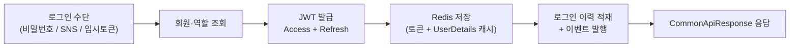
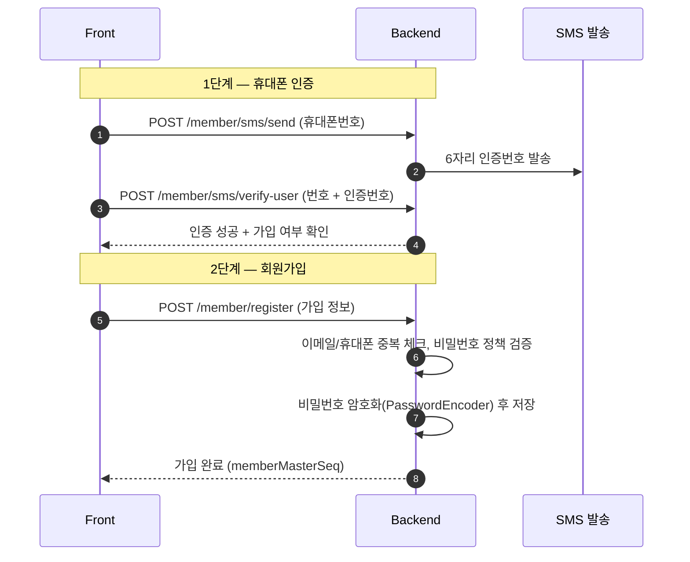
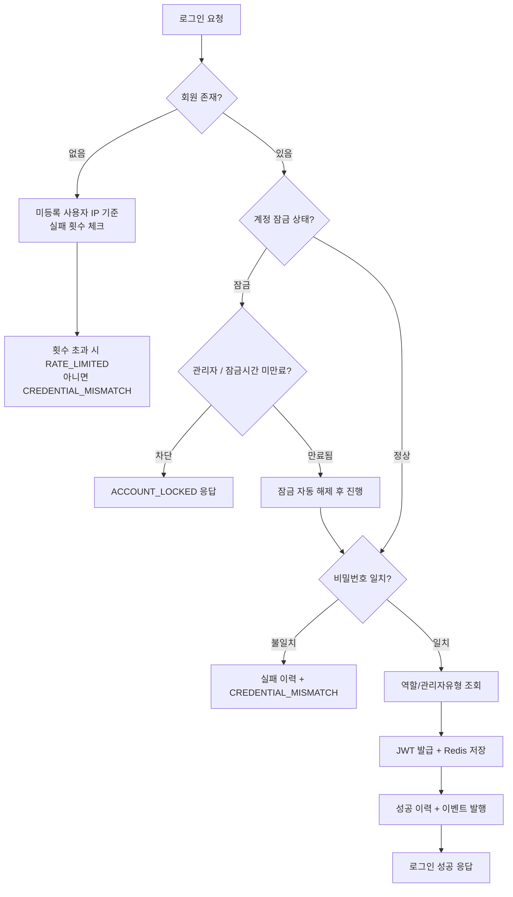
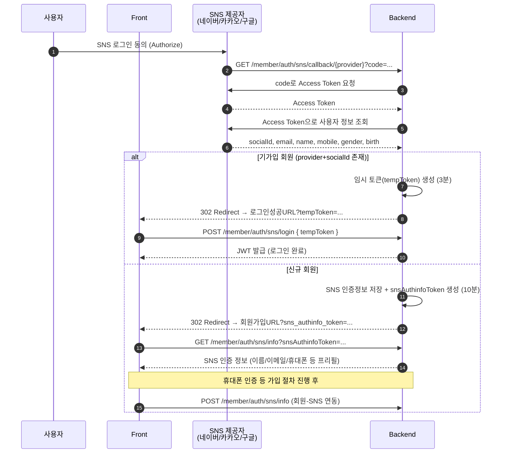
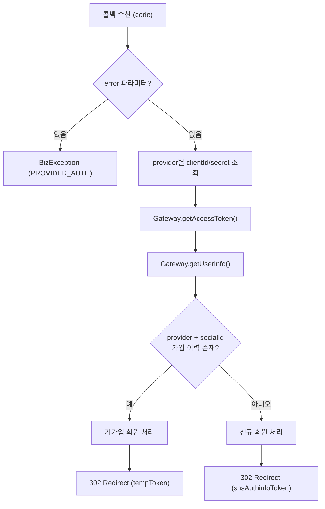
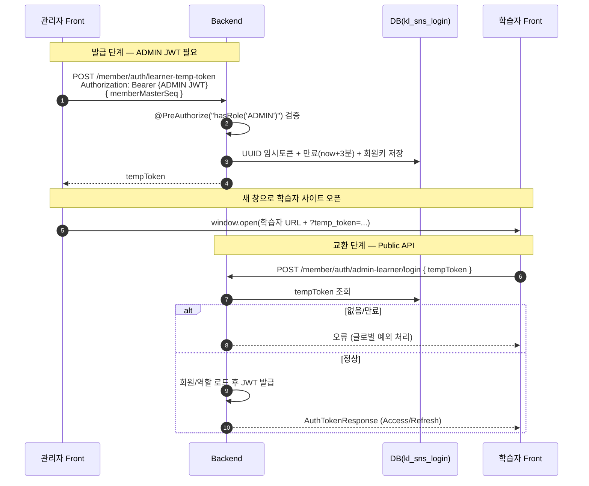

* toc
{:toc .large-only}

# BLER 회원/인증 정리

BLER Admin Backend(Spring Boot 3.3.4 / Java 21)의 회원/인증 영역을 한 글로 정리한다.
인증은 크게 세 갈래로 나뉜다.

1. **일반 가입/로그인** : 아이디(이메일)/비밀번호 기반
2. **SNS 가입/로그인** : 네이버 / 카카오 / 구글 OAuth 2.0 기반
3. **관리자 페이지에서의 사용자(학습자) 대리 로그인** : 임시 토큰(temp token) 교환 방식

세 갈래 모두 최종적으로는 **JWT(Access/Refresh Token)** 를 발급한다는 점에서 출구는 같다.
다만 "어떻게 본인임을 증명하느냐"가 다를 뿐이다. 그 차이를 중심으로 정리한다.

---

## 0. 인증 아키텍처 한눈에 보기

먼저 공통 골격부터 짚고 간다. 어떤 경로로 로그인하든 마지막은 아래로 수렴한다.

- **JWT 설정**: Access Token 1시간(`jwt.expiration=3600000`), Refresh Token 1일(`jwt.refresh-expiration=86400000`)
- **Redis**: 토큰과 `UserDetailsCache`를 함께 저장한다. 매 요청마다 DB를 조회하지 않기 위한 캐시 용도이며, 중복 로그인 차단 옵션(`jwt.redis-duplicate-check-enabled`)도 여기에 얹혀 있다.
  - Redis 저장이 실패해도 로그인 자체는 성공 처리한다. (서비스 중단 방지)
- **로그인 이력**: 성공/실패 모두 `LoginHistoryComponent`로 적재한다. 실패 사유까지 남긴다.
- **TokenRealm**: 같은 사람이라도 `USER`(사용자 사이트)와 `ADMIN`(관리자 사이트) 컨텍스트를 구분해 토큰을 관리한다.

> 모든 API 응답은 `CommonApiResponse`로 감싸진다. 로그인 실패도 HTTP 200으로 내려주되 `success=false` + 실패 타입으로 구분하는 패턴을 쓰는 엔드포인트가 있다는 점이 특징이다.

---

## 1. 일반 가입/로그인 프로세스

### 1-1. 회원가입 (휴대폰 인증 → 가입)

일반 회원가입은 "휴대폰 본인 인증"을 거친 뒤 가입 정보를 제출하는 2단계 흐름이다.

핵심 포인트는 다음과 같다.

- **SMS 인증 API** (`/member/sms`)
  - `POST /member/sms/send` : 휴대폰 번호로 6자리 인증번호 발송
  - `POST /member/sms/verify-user` : 번호 + 인증번호 검증 + 회원가입 여부 확인
  - 이 외에 ID 찾기(`/verify/find-id`), 비밀번호 찾기(`/verify/find-password`)용 검증 API도 별도로 있다.
- **회원가입 API** (`POST /member/register`, `@PublicApi`)
  - 이메일(=회원ID) 중복 체크, 휴대폰번호 중복 체크
  - 비밀번호 정책 검증은 `MemberDomainService.validatePassword(...)`에서 수행 (아이디/휴대폰/이메일과의 유사성까지 검사)
  - 통과하면 `PasswordEncoder`로 암호화 후 저장
- 비밀번호는 **절대 평문으로 저장하지 않는다.** 검증도 `passwordEncoder.matches(raw, encoded)`로만 한다.

### 1-2. 로그인 (`POST /member/auth/token`)

아이디/비밀번호 로그인의 본체다. 단순히 "비밀번호 맞으면 토큰 발급"이 아니라, **계정 잠금 정책**이 꽤 촘촘하게 들어가 있다.

코드상 동작을 풀어 쓰면 이렇다. (`MemberAuthAppQueryServiceImpl.login`)

1. **회원 조회**: `findByMemberIdAndDelYnFalse`로 삭제되지 않은 회원만 조회.
   - 회원이 없으면, 같은 IP에서 "존재하지 않는 아이디"로 반복 시도한 횟수를 확인해 일정 횟수를 넘으면 `LOGIN_RATE_LIMITED`로 막는다. (계정 존재 여부를 캐내려는 시도 방어)
2. **계정 잠금(lock) 처리**: `lockYn`이 true면,
   - 관리자 계정이거나 잠금 시간이 아직 안 지났으면 차단(`ACCOUNT_LOCKED` / `ACCOUNT_LOCKED_ADMIN`).
   - 잠금 시간이 지난 일반 계정이면 **자동으로 잠금을 풀고** 로그인 흐름을 계속한다. 이때 잠금 해제 이력도 남긴다.
3. **비밀번호 검증**: 불일치 시 실패 이력을 남기고 `CREDENTIAL_MISMATCH`.
4. **역할 조회 + 관리자유형(AdminType) 조회**: ADMIN 역할이 있으면 어떤 관리자 유형인지까지 조회.
5. **JWT 발급**: Access/Refresh Token 생성.
6. **Redis 저장**: 기존 토큰 삭제 후 새 토큰 + `UserDetailsCache` 저장.
7. **로그인 이력 + 이벤트 발행**(`MemberMasterEvent`).

> 보안 디테일: 로그인 엔드포인트는 `@ExceptionHandler(MethodArgumentNotValidException)`를 컨트롤러 레벨에서 잡아, 검증 실패 시에도 **"아이디 또는 비밀번호가 일치하지 않습니다"** 라는 동일한 메시지로 응답한다. 어떤 필드가 틀렸는지 흘리지 않기 위함이다.

### 1-3. 토큰 갱신 / 로그아웃

- **Refresh** (`POST /member/auth/refresh`): Refresh Token을 검증하고 새 Access Token을 발급한다. Refresh Token 자체는 재사용(유효기간 연장 없음)한다.
- **Logout** (`POST /member/auth/logout`): 현재 인증된 사용자의 해당 `realm`(user/admin) 토큰을 Redis에서 삭제한다. 바디로 `loginContext`를 받아 어느 컨텍스트를 로그아웃할지 구분한다.

---

## 2. SNS 가입/로그인 프로세스 (네이버 · 카카오 · 구글)

SNS 로그인은 표준 **OAuth 2.0 Authorization Code** 방식이다.
지원 제공자는 `SnsProvider` enum에 정의되어 있다.

| 코드 | 제공자 | 비고 |
| --- | --- | --- |
| `naver` | 네이버 | 토큰 요청 시 redirectUri 미사용 |
| `kakao` | 카카오 | 토큰 요청 시 redirectUri 미사용 |
| `google` | 구글 | **토큰 요청 시 redirectUri 필요** |

SNS 로그인에서 가장 중요한 개념은 "백엔드가 직접 토큰을 프론트로 던지지 않는다"는 점이다.
콜백 처리 결과에 따라 **기가입 회원이면 임시 토큰(tempToken)**, **신규 회원이면 인증정보 토큰(snsAuthinfoToken)** 을 쿼리스트링에 실어 프론트로 redirect한다.
프론트는 그 토큰을 다시 백엔드로 보내 최종 처리(로그인 or 가입)를 한다. 일종의 "토큰 핸드오프" 구조다.

### 2-1. 전체 시퀀스

### 2-2. 콜백 처리 (provider 공통)

네이버/카카오/구글 콜백은 각각 엔드포인트가 있지만 내부적으로는 하나의 `handleCallback`으로 모인다.

- `GET /member/auth/sns/callback/naver`
- `GET /member/auth/sns/callback/kakao`
- `GET /member/auth/sns/callback/google`

이들은 모두 `@PublicApi`이며(인증 불필요), 인가코드(`code`)와 `state`, 에러 파라미터를 받는다.
처리의 핵심은 `SnsAuthAppQueryServiceImpl.handleSnsAuthCallback`에 있다.

provider별 차이는 `SnsAuthGateway` 구현체(`NaverSnsAuthClient` 등)와 팩토리(`SnsAuthClientFactory`)로 흡수한다.
예를 들어 네이버 클라이언트는 토큰 엔드포인트(`nid.naver.com/oauth2.0/token`)와 사용자 정보 엔드포인트(`openapi.naver.com/v1/nid/me`)를 호출하고, 응답 JSON에서 `socialId/email/name/mobile/gender/birth`를 추출한다. 구글만 토큰 교환 시 `redirectUri`를 함께 넘긴다.

### 2-3. 기가입 회원 — 임시 토큰 로그인

이미 해당 SNS로 가입한 회원이라면:

1. `CreateSnsLoginTempTokenCommand`로 **임시 토큰(UUID)** 을 생성한다. 만료는 **3분**(`plusMinutes(3)`), `kl_sns_login` 테이블에 `memberMasterSeq`, `snsProvider`와 함께 저장된다.
2. 프론트 로그인 성공 URL에 `?tempToken=...`을 붙여 302 Redirect.
3. 프론트가 `POST /member/auth/sns/login`으로 `tempToken`을 넘기면, 백엔드(`loginByTempToken`)가:
   - 토큰 조회 → 만료 검사 → 회원/역할 조회 → JWT 발급 → Redis 저장 → 이력/이벤트
   - 일반 로그인과 동일하게 `CommonApiResponse` + 성공/실패 타입으로 응답한다.

### 2-4. 신규 회원 — 인증정보 토큰으로 가입 유도

가입 이력이 없으면:

1. SNS에서 받은 사용자 정보를 `kl_sns_authinfo`에 저장하고 **인증정보 토큰(snsAuthinfoToken)** 을 만든다. 만료는 **10분**.
2. 회원가입 URL에 `?sns_authinfo_token=...`을 붙여 302 Redirect.
3. 프론트는 `GET /member/auth/sns/info?snsAuthinfoToken=...`로 SNS가 준 이름/이메일/휴대폰 등을 **미리 채워(prefill)** 가입 폼을 보여준다.
4. 가입 절차(휴대폰 인증 등)를 마친 뒤 `POST /member/auth/sns/info`로 **회원 ↔ SNS 계정을 연동**(`MemberSnsDomain` 저장)한다. 이때 동일 provider+socialId 중복 연동은 막는다.

> 토큰을 굳이 두 종류(`tempToken` 3분 / `snsAuthinfoToken` 10분)로 나눈 이유: 전자는 "곧바로 로그인"을 위한 일회성 비밀값이라 짧게, 후자는 "사람이 가입 폼을 채우는 시간"을 고려해 더 넉넉하게 잡았다.

---

## 3. 관리자 페이지에서 사용자(학습자) 로그인 처리

CS/운영 상황에서 관리자가 "이 학습자 화면에서 무엇이 보이는지" 직접 확인해야 할 때가 있다.
이를 위해 **관리자가 특정 학습자로 대리 로그인**하는 흐름이 있다. (참고: `docs/learner-temp-token-flow.html`)

핵심 아이디어는 SNS 기가입 로그인과 동일한 "임시 토큰 핸드오프"다.
**관리자가 ADMIN 권한으로 임시 토큰을 발급**받고, **학습자 화면(새 창)** 이 그 토큰을 일회성 비밀번호처럼 넘겨 정식 JWT로 교환한다.

### 3-1. 전체 시퀀스

### 3-2. API 요약

| 구분 | 메서드 · 경로 | 인증 | 설명 |
| --- | --- | --- | --- |
| 임시 토큰 발급 | `POST /member/auth/learner-temp-token` | **ADMIN** (Bearer JWT) | Body `LearnerTokenRequest`(`memberMasterSeq`). 응답에 `tempToken` |
| 임시 토큰 로그인 | `POST /member/auth/admin-learner/login` | 공개(`@PublicApi`) | Body `SnsTempTokenLoginRequest`(`tempToken`). 성공 시 일반 로그인과 동일 형태 JWT 응답 |

구현 근거를 정리하면:

- 발급은 `MemberAuthController.issueLearnerTempToken`이며 `@PreAuthorize("hasRole('ADMIN')")`로 보호된다.
- 임시 토큰 생성/만료(3분)는 `SnsAuthAppCommandServiceImpl.createTempToken`의 `plusMinutes(3)`에서 결정된다.
  - 즉, **SNS 기가입 로그인과 동일한 임시 토큰 메커니즘(`kl_sns_login`)을 그대로 재사용**한다. 관리자 대리 로그인은 "발급 주체가 관리자"라는 점만 다르다.
- 교환은 `loginByTempTokenForAdminLearner` → `SnsAuthAppQueryServiceImpl.loginByTempToken`을 호출해 정식 JWT를 발급한다.

> 과거에는 `POST /member/auth/learner-token`으로 토큰을 바로 발급하는 방식이 있었으나(`@Deprecated`), 토큰이 URL 등에 직접 노출되는 위험을 줄이기 위해 **"짧은 임시 토큰 → 교환"** 방식으로 옮겨갔다.

### 3-3. 프론트엔드가 맞춰야 할 것

- **쿼리 파라미터 이름 통일**: 예시는 `?temp_token=`이지만 SNS 콜백 쪽은 `?tempToken=` 형태를 쓰는 경로도 있다. 학습자 앱이 파싱하는 이름과 반드시 일치시켜야 한다.
- **만료 UX**: 약 3분 내 교환하지 못하면 재발급이 필요하다.
- **보안**: 임시 토큰은 URL에 남을 수 있으므로 로그/북마크/공유에 유의하고, 교환 후 주소창에서 쿼리를 제거하는 것을 권장한다.

---

## 4. 세 가지 흐름 비교

| 구분 | 본인 증명 수단 | 진입점 | 최종 토큰 발급 | 임시 토큰 |
| --- | --- | --- | --- | --- |
| 일반 로그인 | 아이디 + 비밀번호 | `POST /member/auth/token` | 즉시 발급 | 없음 |
| SNS 로그인(기가입) | SNS OAuth | `GET /sns/callback/{provider}` → `POST /sns/login` | 교환 후 발급 | tempToken(3분) |
| SNS 가입(신규) | SNS OAuth | `GET /sns/callback/{provider}` → `GET/POST /sns/info` | 가입 완료 후 로그인 | snsAuthinfoToken(10분) |
| 관리자 대리 로그인 | ADMIN JWT | `POST /learner-temp-token` → `POST /admin-learner/login` | 교환 후 발급 | tempToken(3분) |

세 흐름 모두 결국 **"검증된 신원 → 회원/역할 로드 → JWT 발급 → Redis 저장 → 이력/이벤트"** 라는 동일한 출구로 모인다.
입구(증명 방식)는 다르지만 출구는 하나로 통일해 두었기 때문에, 토큰 발급/세션 관리 로직을 한 곳에서 유지보수할 수 있다는 점이 이 설계의 가장 큰 장점이다.

---

## 5. 마치며

- **공통화**: 로그인의 "출구"를 통일한 덕분에, 새로운 로그인 수단(예: 애플 로그인)을 붙여도 토큰/세션 처리는 재사용할 수 있다.
- **보안**: 비밀번호 평문 미저장, 로그인 메시지 통일(정보 노출 최소화), 미등록 아이디 반복 시도 방지, 계정 잠금 정책, 짧은 만료의 임시 토큰 등 곳곳에 방어 장치를 넣었다.
- **임시 토큰 재사용**: SNS 기가입 로그인과 관리자 대리 로그인이 같은 `kl_sns_login` 메커니즘을 공유한다. 한 번 잘 만든 일회성 토큰 구조를 여러 시나리오에 재활용한 사례다.

