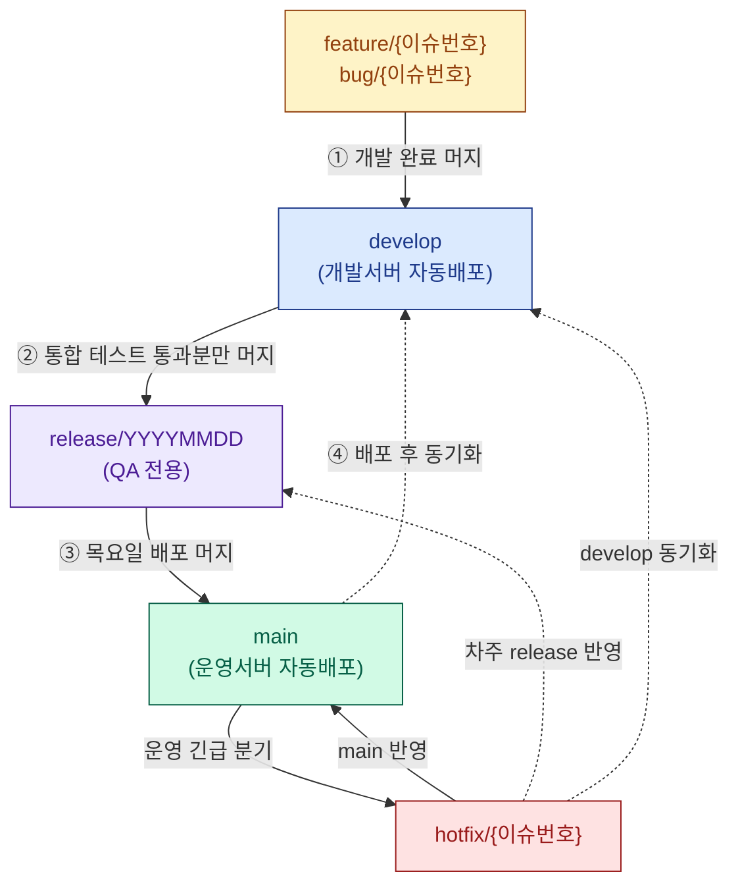

* toc
{:toc .large-only}

# BlerOn 서비스 Git 브랜치 전략

Korea Education Group BlerOn 서비스에서 사용하는 Git 브랜치 전략을 정리한 문서다.
이 전략의 핵심은 **"매주 목요일 정기 배포"라는 고정된 주간 사이클**을 중심으로,
각 브랜치의 역할과 머지 흐름을 명확하게 분리하는 데 있다.

여러 명이 동시에 기능을 개발하더라도

- 어떤 코드가 운영에 나가는지(`main`)
- 어떤 코드가 검수 대상인지(`release`)
- 어떤 코드가 통합 테스트 중인지(`develop`)

를 항상 구분할 수 있어야 사고를 막을 수 있다. 그 구분을 브랜치로 강제하는 것이 이 전략의 목적이다.

---

## 1. 브랜치 역할

먼저 각 브랜치가 어떤 일을 담당하는지부터 정리한다.
가장 중요한 구분은 **"직접 커밋이 가능한 브랜치"** 와 **"머지(merge)로만 코드가 들어오는 브랜치"** 다.

| 브랜치 | 역할 | 직접 커밋 | 자동 배포 |
|--------|------|-----------|-----------|
| `main` | 운영 배포 전용 | ❌ Only Merge | ✅ 운영서버 |
| `release/YYYYMMDD` | 배포 후보 · QA 전용 | ❌ Only Merge | — |
| `develop` | 통합 테스트 | ❌ Only Merge | ✅ 개발서버 |
| `feature/{이슈번호}` | 기능 개발 | ✅ | — |
| `bug/{이슈번호}` | 버그 수정 | ✅ | — |
| `hotfix/{이슈번호}` | 운영 긴급 수정 | ✅ | — |

### 정리하면

- **`main` / `release` / `develop`** 은 **보호 브랜치**다. 개발자가 직접 코드를 밀어 넣을 수 없고,
  오직 PR(Pull Request) 머지를 통해서만 코드가 반영된다. 이렇게 해야 검수되지 않은 코드가
  운영이나 검수 라인에 섞여 들어가는 사고를 막을 수 있다.
- **`feature` / `bug` / `hotfix`** 는 개발자가 실제로 코드를 작성하는 **작업 브랜치**다.
  작업이 끝나면 보호 브랜치로 머지하고, 원격 브랜치는 즉시 삭제한다.
- `feature`와 `bug`는 모두 `develop`을 기준으로 분기한다는 점에서 같지만,
  **새 기능이면 `feature`, 기존 기능의 결함 수정이면 `bug`** 로 이름을 구분해 이력 추적을 쉽게 한다.
- `hotfix`만 유일하게 **`main`을 기준으로 분기**한다. 운영 중인 코드를 긴급 수정해야 하기 때문이다.

> `{이슈번호}` 부분에는 Jira/GitHub Issue 등 이슈 트래커의 번호를 넣는다.
> 예) `feature/1234`, `bug/1287`, `hotfix/1305`

---

## 2. 브랜치 흐름도

전체 흐름을 그림으로 보면 다음과 같다.
`feature/bug`에서 시작한 코드가 `develop` → `release` → `main`으로 한 방향으로만 흘러가고,
긴급 상황에서만 `hotfix`가 `main`에서 분기해 여러 곳으로 다시 합쳐지는 구조다.



### 그림 읽는 법

1. **① 개발 완료 머지** : 개발자가 `feature`/`bug`에서 작업을 끝내면 `develop`으로 머지한다.
   `develop`은 개발서버에 자동 배포되어 여러 기능이 함께 잘 동작하는지 통합 테스트한다.
2. **② 검수 통과분만 머지** : `develop`에서 테스트를 통과한 항목**만** 선별해 `release` 브랜치로 머지한다.
   여기서 "통과한 것만 골라 담는다"는 점이 중요하다. develop에 있다고 무조건 배포되는 게 아니다.
3. **③ 목요일 배포 머지** : QA를 마친 `release`를 `main`에 머지하면 운영서버로 자동 배포된다.
4. **④ 배포 후 동기화** : 배포가 끝나면 `main`의 내용을 다시 `develop`으로 동기화해 두 브랜치의 기준선을 맞춘다.
5. **hotfix** : 운영 장애처럼 다음 주 배포까지 기다릴 수 없는 긴급 상황에서만 `main`에서 분기하여
   `main` + 차주 `release` + `develop` **세 곳에 동시 반영**한다.

> 점선(`-.->`)은 "동기화/반영을 위한 보조 머지"를, 실선은 "메인 흐름의 머지"를 뜻한다.

---

## 3. 주간 배포 사이클

이 전략의 가장 큰 특징은 **요일 기반의 고정된 배포 리듬**이다.
"언제 코드가 잠기고(Code Freeze), 언제 배포되는지"를 팀 전체가 예측할 수 있게 만든다.

| 월~화 | 수요일 | 수~목 | 목요일 | 목요일(배포 후) |
|:---:|:---:|:---:|:---:|:---:|
| **개발** | **Code Freeze** | **QA** | **배포** | **차주 준비** |

| 시점 | 작업 내용 |
|------|-----------|
| **월 ~ 화** | `feature`/`bug` 개발 → `develop` 머지 → 개발서버 통합 테스트 |
| **수요일** | `develop` 테스트 통과 항목만 `release` 브랜치에 머지<br/>**Code Freeze** — 이후 들어온 항목은 차주 `release`로 이동 |
| **목요일** | `release` → `main` 머지 → 운영 자동배포 |
| **목요일(배포 후)** | 즉시 차주 `release/YYYYMMDD` 생성 (`main` 기준)<br/>`main` → `develop` 동기화 머지 |

### Code Freeze가 왜 중요한가

처음 프론트엔드/백엔드를 접하는 입장에서 가장 낯선 개념이 **Code Freeze(코드 동결)** 일 수 있다.

- 배포 직전까지 코드를 계속 추가하면, QA가 검증한 코드와 실제 배포되는 코드가 달라질 수 있다.
- 그래서 **수요일 오후 특정 시점 이후로는 `release`에 더 이상 머지하지 않는다**는 약속을 둔다.
- 동결 이후 완성된 작업은 아무리 급해도(긴급 장애 = hotfix 제외) **다음 주 release로 미룬다.**

즉, "이번 주에 나갈 코드는 수요일에 확정하고, 목요일까지는 그 확정된 코드만 검증·배포한다"는 뜻이다.
이렇게 해야 **"검증한 것과 배포한 것이 같다"** 는 신뢰가 생긴다.

---

## 4. 상세 절차

실제로 브랜치를 어떻게 만들고 머지하는지 시나리오별로 정리한다.

### 4-1. 기능 개발 (feature)

```bash
# 1. develop 기준으로 feature 브랜치 생성
git checkout develop
git pull origin develop
git checkout -b feature/1234

# 2. 개발 후 develop으로 머지 (PR) → 개발서버 통합 테스트
#    GitHub/GitLab에서 feature/1234 → develop PR 생성

# 3. 통합 테스트 통과 후 release 브랜치로 머지 (PR 코드 리뷰 필수)
#    feature/1234 → release/YYYYMMDD PR 생성

# 4. 머지 완료 후 원격 feature 브랜치 즉시 삭제
git push origin --delete feature/1234
```

1. `develop` 기준으로 `feature/{이슈번호}` 브랜치 생성
2. 개발 완료 → `develop` 머지 → 개발서버 통합 테스트
3. 테스트 통과 → `release` 브랜치에 머지 (**PR 코드 리뷰 필수**)
4. 원격 `feature` 브랜치 즉시 삭제 (로컬은 선택 유지)

> ⚠️ **테스트 실패 시**: `develop`에서 해당 커밋을 `revert`한 뒤 재개발한다.
> develop은 보호 브랜치이므로 강제 푸시로 이력을 지우지 않고, revert로 깔끔하게 되돌린다.

### 4-2. 버그 수정 (bug)

1. `develop` 기준으로 `bug/{이슈번호}` 브랜치 생성
2. 수정 완료 → `develop` 머지 → 검수
3. 검수 통과 → `release` 브랜치에 머지
4. 원격 `bug` 브랜치 즉시 삭제

> ⚠️ `release` 머지 전 **PR 코드 리뷰 필수** — develop의 미검수 코드가 release에 혼입되는 것을 방지한다.

`feature`와 절차는 동일하지만, **기존 기능의 결함을 고치는 작업**이라는 점만 다르다.
이름을 구분해 두면 "이번 배포에 새 기능이 몇 개, 버그 수정이 몇 개 포함됐는지"를 이력만으로 파악할 수 있다.

### 4-3. 긴급 운영 수정 (hotfix)

```bash
# 1. main 기준으로 hotfix 브랜치 생성
git checkout main
git pull origin main
git checkout -b hotfix/1305

# 2. 수정 후 main + 차주 release + develop 3곳에 동시 머지
#    (각각 PR 생성 또는 머지)

# 3. 원격 hotfix 브랜치 즉시 삭제
git push origin --delete hotfix/1305
```

1. `main` 기준으로 `hotfix/{이슈번호}` 브랜치 생성
2. 수정 완료 → `main` + `release`(차주) + `develop` **3곳 동시 머지**
3. 원격 `hotfix` 브랜치 즉시 삭제

> ⚠️ **develop 동기화 누락 시 다음 배포에서 동일 버그가 재발한다.**
> hotfix는 `main`에서 분기했기 때문에, develop/release에 반영하지 않으면
> 다음 주 정기 배포 때 "고치기 전 코드"가 다시 운영으로 나가버린다. 가장 흔한 실수이니 주의한다.

---

## 5. 핵심 원칙

마지막으로 이 전략을 지탱하는 다섯 가지 원칙을 정리한다.

| 원칙 | 내용 |
|------|------|
| **release는 QA 전용** | `release` 브랜치에 직접 커밋 금지. 반드시 `feature`/`bug`/`hotfix` PR을 통해서만 반영 |
| **Code Freeze** | 수요일 오후 이후 `release` 머지 금지. 이후 완료된 작업은 차주 `release`로 이동 |
| **hotfix 3곳 동시 머지** | `main` + `release`(차주) + `develop` 3곳에 반드시 머지. develop 누락 시 버그 재발 |
| **원격 브랜치 즉시 삭제** | `feature`/`bug`/`hotfix` 머지 완료 후 원격 브랜치 즉시 삭제. 로컬은 선택 유지 |
| **PR 코드 리뷰 필수** | `develop` → `release` 머지 전 반드시 PR 코드 리뷰. 미검수 코드 혼입 방지 |

---

## 6. staging 환경에 대한 고민과 현실적 선택

브랜치 전략을 설계하면서 가장 아쉬웠던 부분은 **별도의 staging(스테이징) 환경을 두지 못했다**는 점이다.
이 절은 "왜 staging이 없는지, 그래서 어떻게 대응하는지"를 솔직하게 기록한다.

### 6-1. 환경 구성 현황

현재 BlerOn 서비스는 두 개의 환경으로만 운영된다.

| 환경 | 대응 브랜치 | 용도 |
|------|-------------|------|
| 개발(Development) | `develop` | 기능 통합 테스트, 개발자 검증 |
| 운영(Production) | `main` | 실제 사용자 서비스 |

이상적으로는 운영 배포 직전에 **운영과 거의 동일한 환경에서 최종 검증**하는 staging 환경이 한 단계 더 있는 것이 좋다.
`develop`(개발서버)은 데이터와 설정이 운영과 다르기 때문에, 개발서버에서 잘 되던 기능이
운영에서는 데이터 차이로 문제를 일으키는 경우가 있기 때문이다.

### 6-2. 원래 의도했던 staging 구성

처음 계획은 다음과 같은 staging 환경을 만드는 것이었다.

- **전일(D-1) 운영 데이터를 매일(daily) DB 백업**받아 staging DB로 복원
- 운영과 **동일한 수준의 데이터·설정**을 가진 검증 환경 구성
- `release` 브랜치를 이 staging 환경에 배포하여, **운영에 나가기 전 실데이터에 가까운 조건에서 QA** 수행

이렇게 하면 "개발서버에서는 통과했지만 운영 데이터에서는 깨지는" 유형의 결함을 배포 전에 잡아낼 수 있다.

### 6-3. 현실적 제약 — 미지원

그러나 이 구성은 **사내 서버 리소스 부족으로 지원받지 못했다.**

- 별도의 staging 서버(애플리케이션 + DB)를 띄울 **추가 인프라 자원이 없었다.**
- 전일 운영 DB를 매일 백업·복원하는 daily 파이프라인 역시 **별도 스토리지와 운영 비용이 필요**해 지원되지 않았다.

결과적으로 staging 환경 없이 **개발(`develop`) → 운영(`main`)** 2단계 구조로 운영하고 있다.

### 6-4. staging 부재를 보완하는 장치

staging이 없는 만큼, 그 공백을 **브랜치 전략과 프로세스로 보완**한다.

1. **`release` 브랜치를 staging의 "논리적 대체물"로 활용**
   - 비록 운영과 동일한 별도 서버는 없지만, `release` 브랜치는 *배포 후보를 확정*하고
     *QA가 집중적으로 검증하는 전용 라인* 역할을 한다. "코드 수준의 staging"인 셈이다.
2. **Code Freeze로 검증 대상 고정**
   - 수요일 이후 release를 동결해, *검증한 코드 = 배포할 코드* 라는 등식을 보장한다.
3. **PR 코드 리뷰 필수화**
   - 실데이터 검증 환경이 없는 만큼, 사람이 보는 코드 리뷰의 비중을 높여 결함을 사전에 거른다.
4. **hotfix 프로세스 정비**
   - staging에서 못 걸러 운영에서 터지는 이슈를 빠르게 수습할 수 있도록,
     `main` 기준 hotfix와 3곳 동시 머지 규칙을 명확히 해 둔다.

### 6-5. 향후 개선 방향

리소스가 확보되면 다음 순서로 staging 환경을 도입하는 것이 목표다.

- (1단계) 운영 DB의 **전일 백업 → staging DB 복원 daily 파이프라인** 구축
- (2단계) `release` 브랜치 전용 **staging 애플리케이션 서버** 분리 배포
- (3단계) staging 검증 통과를 `main` 머지의 **필수 게이트(gate)** 로 승격

> 정리하면, **staging 환경 구성은 기술적 필요성은 충분히 인지하고 설계까지 마쳤으나
> 사내 추가 서버 리소스 미지원으로 보류된 상태**이며, 현재는 `release` 브랜치 + Code Freeze + 코드 리뷰로
> 그 공백을 최대한 메우고 있다.

---

## 마무리

이 브랜치 전략의 본질은 화려한 도구가 아니라 **"역할 분리 + 고정된 리듬 + 명확한 약속"** 이다.

- 보호 브랜치(`main`/`release`/`develop`)와 작업 브랜치(`feature`/`bug`/`hotfix`)를 나누고,
- 매주 목요일 배포라는 고정 리듬과 수요일 Code Freeze로 예측 가능성을 확보하고,
- PR 코드 리뷰와 hotfix 3곳 동시 머지 같은 약속을 지키는 것.

staging 환경처럼 갖추지 못한 부분은 분명히 있지만, 그 한계를 인지하고
프로세스로 보완한다는 점에서 이 전략은 "현재 가진 리소스 안에서의 최선"이라 할 수 있다.
