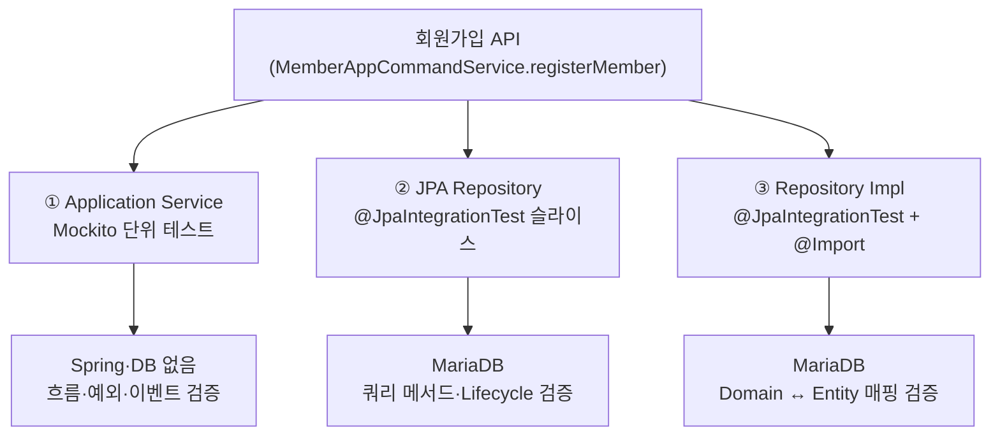
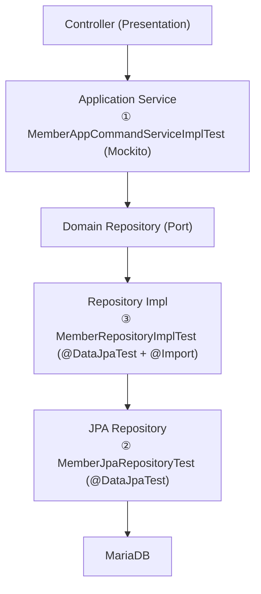

* toc
{:toc .large-only}

# BlerOn JUnit 5 단위테스트 정리

BlerOn Backend(Spring Boot / DDD + Hexagonal + CQRS)에서 사용하는 JUnit 5 단위·슬라이스 테스트 전략을 한 글로 정리한다.

이 전략의 핵심은 **`@SpringBootTest` 하나로 전체를 검증하지 않고, 계층별로 테스트를 분리**하는 데 있다. 회원가입 API(`MemberAppCommandService.registerMember`)를 기준으로 Application Service · JPA Repository · Repository Impl **3계층에 각각 테스트를 두면** 실행 속도와 실패 원인 추적이 모두 나아진다. H2에서 MariaDB로 전환하면서 겪은 시행착오와, `@DataJpaTest` 슬라이스 테스트를 안정적으로 구성하는 방법까지 함께 다룬다.

---

## 0. 테스트 전략 한눈에 보기

먼저 3계층 테스트가 어떻게 나뉘는지부터 짚고 간다.



| 구분 | 계층 | 테스트 클래스 | DB |
| --- | --- | --- | --- |
| 비즈니스 | Application Service | `MemberAppCommandServiceImplTest` | ❌ |
| 영속성 | JPA Repository | `MemberJpaRepositoryTest` | ✅ MariaDB |
| 어댑터 | Repository Impl | `MemberRepositoryImplTest` | ✅ MariaDB |

- **기술 스택**: JUnit 5 · Mockito · Spring Boot Test · `@DataJpaTest` · MariaDB
- **네이밍**: `should_{결과}_When_{조건}_Then_{기대}`
- **구조**: given → when → then · AssertJ · Mockito BDD
- **DisplayName**: 한글로 검증 의도 명시

> 각 계층은 **검증 목적이 다르기 때문에** 분리한다. 한 테스트가 모든 것을 검증하려 하면 유지보수가 어려워진다.

---

## 1. 계층별 표준

### 1-1. Application Service — Mockito 단위 테스트

Spring 컨텍스트 없이 **비즈니스 흐름만** 검증한다.

```java
@ExtendWith(MockitoExtension.class)
class MemberAppCommandServiceImplTest {

    @Mock
    private MemberRepository memberRepository;

    @InjectMocks
    private MemberAppCommandServiceImpl memberAppCommandService;

    @Test
    @DisplayName("일반 회원가입 성공 시 memberId와 memberMasterSeq를 반환한다")
    void should_RegisterMember_When_ValidCommand_Then_Success() {
        // given → when → then
    }
}
```

| 항목 | 내용 |
| --- | --- |
| Spring 컨텍스트 | ❌ 로드하지 않음 |
| 의존성 | `@Mock` + `@InjectMocks` |
| 검증 범위 | 중복 검증, 예외 분기, 이벤트 발행 |
| DB | 사용하지 않음 |

### 1-2. JPA Repository — 슬라이스 테스트

Spring Data JPA **쿼리 메서드**와 Entity **Lifecycle 콜백**을 검증한다.

```java
@JpaIntegrationTest
class MemberJpaRepositoryTest {

    @Autowired
    private MemberJpaRepository memberJpaRepository;

    @Autowired
    private TestEntityManager entityManager;
}
```

| 항목 | 내용 |
| --- | --- |
| 어노테이션 | `@JpaIntegrationTest` (구체 클래스에 직접 선언) |
| 데이터 조작 | `TestEntityManager` 또는 Repository |
| 롤백 | `@DataJpaTest` 기본 `@Transactional` 롤백 |
| 테스트 데이터 | Fixture의 `unique*()` 메서드로 충돌 방지 |

### 1-3. Repository Impl — 어댑터 슬라이스 테스트

Domain Port 구현체의 **매핑·HMAC 변환·어댑터 로직**을 검증한다.

```java
@JpaIntegrationTest
@Import({ MemberRepositoryImpl.class, MemberJpaMapper.class })
class MemberRepositoryImplTest {

    @Autowired
    private MemberRepositoryImpl memberRepository;

    @MockBean
    private AdminJpaRepository adminJpaRepository;  // Impl 생성자 의존성
}
```

| 항목 | 내용 |
| --- | --- |
| `@Import` | 테스트 대상 Impl + JpaMapper |
| `@MockBean` | Impl 생성자에 필요하지만 이번 테스트 범위 밖인 JpaRepository |
| 검증 범위 | Domain ↔ Entity 매핑, HMAC 변환, 어댑터 호출 |

---

## 2. 공통 설정

### 2-1. `build.gradle`

```gradle
testImplementation 'org.springframework.boot:spring-boot-starter-test'
testRuntimeOnly 'org.mariadb.jdbc:mariadb-java-client:3.3.3'
```

- `spring-boot-starter-test`: JUnit 5, AssertJ, Mockito, Spring Test 포함
- `mariadb-java-client`: Repository 슬라이스 테스트 JDBC 드라이버

### 2-2. `application-test.yml`

Repository 슬라이스 테스트 전용 Spring Profile (`test`).

| 설정 | 목적 |
| --- | --- |
| `spring.test.database.replace: none` | `@DataJpaTest`가 H2로 datasource를 치환하지 않도록 함 |
| `ddl-auto: none` | 기존 스키마 유지, DDL 실행 금지 |
| `MariaDBDialect` | Hibernate dialect 자동 감지 실패 방지 |
| Redis autoconfigure exclude | Repository 테스트에 Redis 불필요 |
| Hikari pool size 4 | 테스트용 최소 커넥션 풀 |

```yaml
spring:
  test:
    database:
      replace: none
  datasource:
    url: jdbc:mariadb://${TEST_DB_HOST:localhost}:${TEST_DB_PORT:3306}/${TEST_DB_NAME:bler}?characterEncoding=UTF-8&serverTimezone=Asia/Seoul
    driver-class-name: org.mariadb.jdbc.Driver
    username: ${TEST_DB_USERNAME}
    password: ${TEST_DB_PASSWORD}
    hikari:
      maximum-pool-size: 4
      minimum-idle: 1
      connection-timeout: 20000
  jpa:
    hibernate:
      ddl-auto: none
    database-platform: org.hibernate.dialect.MariaDBDialect
    properties:
      hibernate:
        ddl-auto: none
        dialect: org.hibernate.dialect.MariaDBDialect
  autoconfigure:
    exclude:
      - org.springframework.boot.autoconfigure.data.redis.RedisAutoConfiguration
      - org.redisson.spring.starter.RedissonAutoConfiguration
```

> dev DB와 동일한 스키마를 사용하므로 **VPN·사내망 접속**이 필요할 수 있다.  
> 테스트 데이터는 `@Transactional` 롤백 + `uniqueMemberId()` 등으로 충돌을 방지한다.

### 2-3. `@JpaIntegrationTest` (공통 메타 어노테이션)

Repository 슬라이스 테스트에 공통으로 붙이는 **커스텀 메타 어노테이션**이다.

```java
@DataJpaTest(properties = {
    "spring.test.database.replace=none",
    "spring.jpa.hibernate.ddl-auto=none",
    "spring.jpa.properties.hibernate.ddl-auto=none",
    "spring.jpa.database-platform=org.hibernate.dialect.MariaDBDialect"
})
@ActiveProfiles(value = "test", inheritProfiles = false)
@EntityScan(basePackageClasses = MemberMasterEntity.class)
@EnableJpaRepositories(
    basePackages = "kr.co.bler.infrastructure.persistence.repository.member",
    includeFilters = @ComponentScan.Filter(
        type = FilterType.ASSIGNABLE_TYPE,
        classes = MemberJpaRepository.class
    )
)
@Import({ ApplicationContextProvider, Aes256Util, Hmac256Util, EncryptedStringConverter })
public @interface JpaIntegrationTest {}
```

| 구성 요소 | 역할 |
| --- | --- |
| `@DataJpaTest` | JPA·Repository 관련 빈만 로드하는 슬라이스 테스트 |
| `@ActiveProfiles("test")` | `application-test.yml` 활성화 |
| `@EntityScan` | 테스트에 필요한 Entity만 등록 |
| `@EnableJpaRepositories` + `includeFilters` | **대상 Repository만** 등록 (하위 패키지 제외) |
| `@Import` | `@PrePersist` HMAC, 암호화 Converter 등 Entity 콜백에 필요한 유틸 |

> 회원 외 Domain 테스트 추가 시 `@JpaIntegrationTest`를 그대로 쓰지 말고, Entity·Repository 범위에 맞는 **별도 메타 어노테이션**을 만드는 것을 권장한다.

### 2-4. `JpaTestSupport` (선택적 베이스 클래스)

```java
@JpaIntegrationTest
public abstract class JpaTestSupport {}
```

IDE/Gradle에서 메타 어노테이션 상속이 누락될 수 있으므로, **구체 테스트 클래스에 `@JpaIntegrationTest`를 직접 선언**한다.

### 2-5. `MemberTestFixture` (테스트 데이터 팩토리)

| 메서드 | 용도 |
| --- | --- |
| `uniqueMemberId()` | dev DB 충돌 방지용 고유 이메일 (`junit-test-{uuid}@example.com`) |
| `uniqueMobile()` | dev DB 충돌 방지용 고유 휴대폰 (`0109XXXXXXX`) |
| `learnerCommand()` | Service 테스트용 `RegisterMemberCommand` 기본값 |
| `memberEntity(...)` | JPA 테스트용 `MemberMasterEntity` 생성 |
| `savedMemberDomain(...)` | Service Mock 응답용 `MemberDomain` |

---

## 3. TestClass 별 용도

### 3-1. `MemberAppCommandServiceImplTest`

**경로:** `application/service/member/MemberAppCommandServiceImplTest.java`

| 테스트 | 검증 내용 |
| --- | --- |
| `should_RegisterMember_When_ValidCommand_Then_Success` | 정상 가입 시 `memberId`, `memberMasterSeq` 반환 및 이벤트 발행 |
| `should_ThrowBizException_When_DuplicateEmail_Then_Fail` | 이메일 중복 시 `BizException` |
| `should_ThrowBizException_When_DuplicateMobile_Then_Fail` | 휴대폰 중복 시 `BizException` |

### 3-2. `MemberJpaRepositoryTest`

**경로:** `infrastructure/persistence/repository/member/MemberJpaRepositoryTest.java`

| 테스트 | 검증 내용 |
| --- | --- |
| `should_ReturnTrue_When_ActiveMemberExists_Then_ExistsByMemberIdAndDelYnFalse` | 활성 회원 존재 → `true` |
| `should_ReturnFalse_When_DeletedMember_Then_ExistsByMemberIdAndDelYnFalse` | 삭제 회원 → `false` |
| `should_SetHmacSearchFields_When_SaveMember_Then_PrePersistApplied` | 저장 시 HMAC 검색 필드 자동 설정 |

### 3-3. `MemberRepositoryImplTest`

**경로:** `infrastructure/persistence/repository/member/MemberRepositoryImplTest.java`

| 테스트 | 검증 내용 |
| --- | --- |
| `should_ReturnTrue_When_MemberIdExists_Then_ExistsByEmail` | `existsByEmail` → JPA 쿼리 연동 |
| `should_ReturnTrue_When_MobileExists_Then_ExistsByMobile` | 평문 mobile → HMAC 변환 후 조회 |
| `should_SaveMember_When_ValidDomain_Then_ReturnSavedDomain` | Domain 저장 → PK 생성 및 필드 매핑 |

---

## 4. 시행착오 — 오류와 해결

실제로 테스트 환경을 구성하면서 겪은 오류와 해결 과정이다.

### 4-1. H2 + `ddl-auto` 충돌 → MariaDB 전환

**증상**

```
Table 'KL_MEMBER_MASTER' not found (database is empty)
```

**원인**

- H2 인메모리 DB + `ddl-auto: create-drop` 조합 시도
- `@DataJpaTest` 기본 동작과 충돌하거나, 실제 스키마·제약조건과 불일치

**해결**

- `application-test.yml`을 **development MariaDB**로 전환
- `ddl-auto: none` — 기존 테이블 구조 그대로 사용

---

### 4-2. `Unable to determine Dialect without JDBC metadata`

**증상**

```
Unable to determine Dialect without JDBC metadata
```

**원인**

- `@DataJpaTest` 기본값 `spring.test.database.replace=ANY`가 datasource URL을 **H2로 치환**
- MariaDB URL이 무시되어 Hibernate dialect 감지 실패

**해결**

- `application-test.yml`: `spring.test.database.replace: none`
- `@DataJpaTest(properties = {...})` **어노테이션에도 동일 property 인라인 명시**
- `spring.jpa.database-platform=org.hibernate.dialect.MariaDBDialect` 추가

---

### 4-3. 메타 어노테이션 / 추상 클래스 설정 미적용

**증상**

- IDE에서 테스트 실행 시 yml 설정이 반영되지 않음

**원인**

- 메타 어노테이션 + 추상 베이스 클래스 조합에서 IDE Test Runner가 설정 상속을 누락

**해결**

- `@JpaIntegrationTest`를 **구체 테스트 클래스에 직접** 선언
- 핵심 property는 `@DataJpaTest(properties = {...})`에 **인라인**으로 중복 명시

---

### 4-4. `Could not resolve join path 'CategoryEntity'` (Repository 과다 스캔)

**증상**

```
Failed to load ApplicationContext
  └─ lecturerJpaRepository 빈 생성 실패
       └─ Could not resolve join path 'CategoryEntity'
```

**원인**

```java
// ❌ 문제가 있던 설정
@EnableJpaRepositories(basePackageClasses = MemberJpaRepository.class)
@EntityScan(basePackageClasses = MemberMasterEntity.class)
```

- `basePackageClasses = MemberJpaRepository.class` → `member` **패키지 전체**(하위 `lecturer`, `learner` 등) 스캔
- `LecturerJpaRepository` JPQL이 `CategoryEntity` JOIN
- `@EntityScan`에는 `MemberMasterEntity`만 등록 → `CategoryEntity` 없음 → 쿼리 검증 실패

**해결**

```java
// ✅ 수정 후 — 대상 Repository만 등록
@EnableJpaRepositories(
    basePackages = "kr.co.bler.infrastructure.persistence.repository.member",
    includeFilters = @ComponentScan.Filter(
        type = FilterType.ASSIGNABLE_TYPE,
        classes = MemberJpaRepository.class
    )
)
```

`includeFilters`가 있으면 Spring Data JPA는 **필터에 맞는 Repository만** 등록한다.

---

### 4-5. DB 연결 타임아웃 (네트워크)

**증상**

```
CannotCreateTransactionException: Could not open JPA EntityManager for transaction
  └─ Connect timed out
```

**원인**

- 테스트 DB 서버에 **네트워크 접근 불가** (VPN 미연결, 방화벽, 서버 다운)

**해결**

- VPN/사내망 연결 후 재실행
- PowerShell: `Test-NetConnection -ComputerName $env:TEST_DB_HOST -Port $env:TEST_DB_PORT`

> ApplicationContext 로드까지 성공하고 트랜잭션 시작 단계에서 실패하면, **코드 문제가 아니라 네트워크 문제**일 가능성이 높다.

---

### 4-6. Gradle `GradleWorkerMain` ClassNotFoundException

**증상**

```
Could not find or load main class worker.org.gradle.process.internal.worker.GradleWorkerMain
```

**대응**

- IDE(Cursor/IntelliJ) Test Runner로 개별 실행
- `./gradlew clean test` 또는 Gradle 캐시 정리 후 재시도

---

## 5. Service / JPA 레벨 테스트를 하는 이유

### 5-1. 왜 3계층으로 나누는가?



`@SpringBootTest`로 전체를 올리면 **느리고**, 실패 시 **원인 파악이 어렵다**.  
계층별로 나누면 **빠르고**, **실패 지점이 명확**하다.

### 5-2. Service 레벨 테스트 (Mockito)

| 장점 | 한계 |
| --- | --- |
| Spring·DB 없이 밀리초 단위 실행 | SQL·Entity 매핑 미검증 |
| 중복 검증, 예외 분기, 이벤트 발행 집중 | HMAC 변환 미검증 |
| Repository·DB 장애와 무관 | → JPA/Impl 테스트로 보완 |

### 5-3. JPA Repository 레벨 테스트

| 장점 | 한계 |
| --- | --- |
| `existsByMemberIdAndDelYnFalse` 등 쿼리 메서드 검증 | Domain ↔ Entity 매핑 미검증 |
| `@PrePersist` HMAC 검색 필드 등 Lifecycle 검증 | |
| `@SpringBootTest` 대비 경량 슬라이스 | |

### 5-4. Repository Impl 레벨 테스트

| 장점 |
| --- |
| Domain Port 어댑터가 JPA Repository를 올바르게 호출하는지 확인 |
| 평문 mobile → `mobileFullSearch` HMAC 변환 후 조회 검증 |
| `MemberDomain` ↔ `MemberMasterEntity` 변환 및 PK 생성 확인 |
| Hexagonal Architecture Infrastructure Layer 격리 테스트 |

### 5-5. 검증 매트릭스

| 검증 대상 | Service (Mockito) | JpaRepository | RepositoryImpl |
| --- | :---: | :---: | :---: |
| 중복 이메일/휴대폰 예외 | ✅ | — | — |
| 가입 성공·이벤트 | ✅ | — | — |
| JPA 쿼리 메서드 | — | ✅ | — |
| `@PrePersist` HMAC | — | ✅ | — |
| Domain ↔ Entity 매핑 | — | — | ✅ |
| HMAC 변환 조회 | — | — | ✅ |
| DB 연결 필요 | ❌ | ✅ | ✅ |
| 실행 속도 | ⚡ 매우 빠름 | 🐢 보통 | 🐢 보통 |

---

## 6. 신규 기능 테스트 추가 가이드

### Service 테스트

```java
@ExtendWith(MockitoExtension.class)
class XxxAppServiceTest {
    @Mock private XxxRepository xxxRepository;
    @InjectMocks private XxxAppServiceImpl xxxAppService;
    // given-when-then + should_When_Then 네이밍
}
```

### Repository 슬라이스 테스트

1. 테스트 클래스에 `@JpaIntegrationTest` 직접 선언
2. `@EntityScan` / `@EnableJpaRepositories` 범위를 **테스트 대상에 맞게 최소화**
3. Fixture에 `unique*()` 메서드로 **고유 테스트 데이터** 생성
4. dev DB 사용 시 `@Transactional` 롤백 전제

### 체크리스트

- [ ] Service: `@ExtendWith(MockitoExtension.class)`, `@Mock` / `@InjectMocks`
- [ ] Repository: `@JpaIntegrationTest` 직접 선언
- [ ] `@EnableJpaRepositories`가 하위 패키지 Repository까지 스캔하지 않는지 확인
- [ ] `@EntityScan`에 JPQL이 참조하는 Entity가 모두 포함되는지 확인
- [ ] `spring.test.database.replace=none` (yml + `@DataJpaTest` properties)
- [ ] `ddl-auto: none`

### 파일 구조

```
src/test/
├── resources/
│   └── application-test.yml
├── java/kr/co/bler/
│   ├── application/service/member/
│   │   └── MemberAppCommandServiceImplTest.java   # Service Mockito 단위 테스트
│   ├── infrastructure/persistence/repository/member/
│   │   ├── MemberJpaRepositoryTest.java           # JPA Repository 슬라이스
│   │   └── MemberRepositoryImplTest.java          # Repository Impl 슬라이스
│   └── support/
│       ├── JpaIntegrationTest.java                # Repository 공통 메타 어노테이션
│       ├── JpaTestSupport.java
│       └── fixture/
│           └── MemberTestFixture.java
```

---

## 7. 마치며

회원가입 API 하나를 기준으로 **Service(Mockito) · JpaRepository · RepositoryImpl** 3계층 테스트를 분리하면, 각 계층의 책임에 맞는 검증을 빠르게 수행할 수 있다.

특히 `@DataJpaTest` 슬라이스 테스트에서는 다음 세 가지가 핵심이다.

1. `spring.test.database.replace=none` — H2 치환 방지
2. `ddl-auto: none` — dev DB 스키마 보호
3. `@EnableJpaRepositories` **스캔 범위 최소화** — 불필요한 Repository·Entity 로드 방지

같은 패턴으로 다른 Domain에도 테스트를 확장할 수 있다. Domain마다 `@EntityScan` / `includeFilters` 범위가 다르므로, 공통 메타 어노테이션을 무리하게 재사용하지 않는 것이 중요하다.
