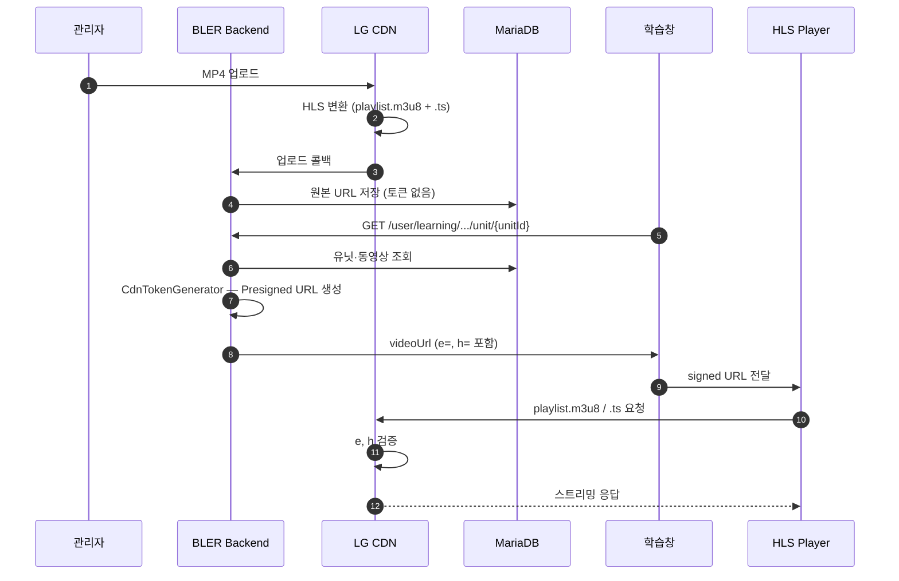

* toc
{:toc .large-only}

# BlerOn 학습창 동영상 Presigned URL 정리

BlerOn 학습창에서 동영상을 재생할 때, 클라이언트는 **DB에 저장된 원본 URL**을 직접 사용하지 않는다. Backend API가 응답을 생성하는 시점에 **LG CDN(CloudN) Enguard 규격**에 맞는 **Presigned URL**을 만들어 내려주고, Frontend HLS Player가 이 URL로 CDN에 스트리밍을 요청한다.

이 글은 **업로드 → DB 저장 → API 응답 → Frontend 재생**까지의 전체 흐름과, `CdnTokenGenerator`의 URL 서명 알고리즘·만료 시간 계산·보안 한계를 한 곳에 정리한다. MultiDRM 미적용 배경과 향후 도입 시 변경 포인트도 함께 다룬다.

---

## 0. 개요 한눈에 보기

먼저 Presigned URL이 어떻게 만들어지고 전달되는지부터 짚고 간다.

```
┌─────────────┐     API 요청      ┌─────────────┐    Presigned URL    ┌─────────────┐
│  학습창 FE  │ ───────────────▶ │ BLER Backend │ ──────────────────▶ │  HLS Player │
└─────────────┘                   └─────────────┘                     └──────┬──────┘
                                                                             │
                                                                             ▼
                                                                    ┌─────────────┐
                                                                    │   LG CDN    │
                                                                    │  (토큰 검증) │
                                                                    └─────────────┘
```

| 파라미터 | 설명 |
| --- | --- |
| `e` | 만료 시각 (Unix timestamp, UTC) |
| `h` | `secret-key` + URL + `e` 로 생성한 MD5 해시 |
| `playtype=preview` | 미리보기 전용 (Preview API만) |
| `vodstart` / `vodend` | 미리보기 재생 구간 (초) |

| 단계 | 저장/전달 데이터 | 토큰 포함 |
| --- | --- | :---: |
| CDN 업로드 후 | `{CDN_STREAMING_URL}/{bucket}/{yyyy}/{MM}/{uuid}/playlist.m3u8` | ❌ |
| DB (`unit_video.video_path`) | 위와 동일 | ❌ |
| API 응답 (`unitVideo.videoUrl`) | `...?e={timestamp}&h={hash}` | ✅ |
| HLS Player 요청 | API에서 받은 URL 그대로 사용 | ✅ |

> DB에는 **토큰 없는 원본 URL만** 저장하고, API 응답 시점에만 Presigned URL을 부여한다.

---

## 1. 보안 정책

### 1-1. MultiDRM 미적용

| 항목 | 내용 |
| --- | --- |
| 검토 항목 | Widevine, FairPlay, PlayReady 등 MultiDRM |
| 미적용 사유 | 개발 리소스 부족, 라이선스·운영 **비용 이슈** |
| 적용 대안 | LG CDN Enguard Module + **Hash Presigned URL** |

> MultiDRM은 영상 파일 자체를 암호화해 키 교환으로 보호한다.  
> 현재는 **URL 서명 + 만료 시간**으로 무단 접근을 **최소한** 방어한다.

### 1-2. 현재 보안 전략 요약

```
[적용 O]  URL Hash 서명 (secret-key + MD5)
[적용 O]  만료 시간 (영상 길이 기반 동적 계산)
[적용 O]  Preview 구간 제한 (LG CDN vodend)
[적용 O]  DB에는 토큰 없는 원본 URL만 저장
[적용 O]  수강·학습기간 검증 (정식 학습)
[미적용]  MultiDRM / 콘텐츠 암호화
```

---

## 2. 전체 흐름

### 2-1. End-to-End 시퀀스



---

## 3. 업로드 & DB 저장

### 3-1. LG CDN 업로드

| 항목 | 설명 |
| --- | --- |
| 업로드 방식 | LG CDN REST API (multipart 업로드) |
| 구현 클래스 | `LGCdnStorageClient` |
| 변환 결과 | `playlist.m3u8` + `.ts` 세그먼트 (HLS) |

### 3-2. CDN 콜백 처리

```
POST /api/v1/cdn/callbacks
```

**처리 내용 (`CdnFileAppServiceImpl.registerUploadedFile`)**

1. 스트리밍 URL 조립 — `{streaming-url}/{subPath}/{uuid}/playlist.m3u8`
2. Presigned URL 생성 (FFmpeg duration 추출용)
3. FFmpeg로 **재생 시간(duration)** 추출
4. `cdn_file` 테이블에 메타 저장

### 3-3. 유닛-동영상 매핑

유닛 등록 시 `UnitVideoAppService`가 CDN 파일과 연결한다.

```
CdnFileDomain.fileConvertPath  →  unit_video.video_path
.mp4 경로                       →  /playlist.m3u8 로 변환 (changeFilePath)
```

**DB 저장 예시 (토큰 없음)**

```
{CDN_STREAMING_URL}/{bucket}/{yyyy}/{MM}/{uuid}/playlist.m3u8
```

---

## 4. 학습창 API & URL 생성

### 4-1. 관련 API

| API | 용도 | Presigned 적용 |
| --- | --- | :---: |
| `GET /user/learning/class/{classId}/round/{round}/section/{sectionId}/unit/{unitId}` | 정식 학습 | ✅ Enguard |
| `GET /user/learning/class/{classId}/round/{round}/preview` | 미리보기 | ✅ LG Preview |

### 4-2. 정식 학습 호출 체인

```
LearningUnitUserController.getUnit()
    │
    ▼
LearningUnitAppQueryServiceImpl.getLearnUnit()
    ├── confirmEnrollmentStatus()   ← 수강·학습기간 검증
    └── LearningUnitAppComponent.getUnitByDivision(VIDEO)
            └── UnitVideoRepositoryImpl.findByUnitId()
    │
    ▼
LearningUnitResponse.from()
    └── LearningVideoResponse
            └── LearnUnitVideo.from()   ★ Presigned URL 생성
```

### 4-3. 응답 DTO — `LearnUnitVideo.from()`

| 필드 | 생성 방식 | 만료 기준 |
| --- | --- | --- |
| `videoUrl` | CloudN Enguard | `(영상길이 + 300초) × 2 + expire-time` |
| `introUrl` | Enguard (Preview 모드) | `preview-expire-time` |
| `outroUrl` | Enguard (Preview 모드) | `preview-expire-time` |

> **300초 버퍼** (`VIDEO_DURATION_BUFFER`)  
> 재생 중 토큰이 만료되어 끊기는 것을 방지하기 위한 여유 시간이다.

### 4-4. 미리보기 호출 체인

```
LearningUnitUserController.getPreviewUnits()
    │
    ▼
LearningUnitAppQueryServiceImpl.getPreviewUnits()
    └── unitVideoRepository.findByUnitIdIn()   ← 원본 URL
    │
    ▼
LearningPreviewCurriculumResponse.from()
    └── CdnTokenGenerator.generateCdnUrl(
            url, duration, isPreview=true, previewDuration)
```

**Preview 전용 파라미터**

| 파라미터 | 값 | 설명 |
| --- | --- | --- |
| `playtype` | `preview` | 미리보기 모드 |
| `vodstart` | `0` | 시작 지점 (초) |
| `vodend` | `previewDuration + 30` | 종료 지점 + 버퍼 |
| `chunkduration` | `10` | HLS chunk 단위 (초) |

---

## 5. CdnTokenGenerator 상세

**경로:** `application/service/utils/cdn/CdnTokenGenerator.java`

### 5-1. 설정값 (`config/cdn/cdn-{profile}.yml`)

```yaml
app:
  cdn:
    secret-key: ${CDN_SECRET_KEY}   # 해시 생성 비밀키 (환경변수 주입)
    expire-time: 600                # 정식 재생 추가 버퍼 (초)
    preview-expire-time: 3600       # Preview / Intro / Outro (초)

  ftp:
    streaming-url: ${CDN_STREAMING_URL}

  vod:
    intro: ${VOD_INTRO_URL}
    outro: ${VOD_OUTRO_URL}
```

> 실제 URL·비밀키 값은 환경별 설정 파일 또는 환경변수로 관리한다.  
> 본 글에는 **민감정보를 포함하지 않는다.**

### 5-2. 알고리즘 A — CloudN Enguard (정식 학습)

```
① expire = UTC현재시각 + (videoDuration × 2) + expire-time
② hashKeyUrl = 원본 URL에서 /playlist.m3u8 제거
③ raw      = secret-key + hashKeyUrl + "?e=" + expire
④ h        = MD5(raw)
⑤ 결과 URL = 원본URL + "?e={expire}&h={h}"
```

**`/playlist.m3u8` 제거 이유**

HLS 재생 중 playlist ↔ segment 경로가 바뀌어도,  
CDN이 **디렉터리 단위**로 토큰을 검증할 수 있도록 하기 위함이다.

### 5-3. 알고리즘 B — LG CDN Preview (미리보기)

```
hashInput = secret-key + hashKeyUrl
          + "?e=" + expire
          + "&playtype=preview"
          + "&chunkduration=10"
          + "&vodstart=0"
          + "&vodend=" + (previewDuration + 30)

h = MD5(hashInput)
```

### 5-4. URL 예시 (구조만 표기)

**정식 학습**

```
{CDN_STREAMING_URL}/{bucket}/{yyyy}/{MM}/{uuid}/playlist.m3u8
  ?e={unix_timestamp}
  &h={md5_hash}
```

**미리보기 (previewDuration = 60초 기준)**

```
{CDN_STREAMING_URL}/{bucket}/{yyyy}/{MM}/{uuid}/playlist.m3u8
  ?e={unix_timestamp}
  &playtype=preview
  &chunkduration=10
  &vodstart=0
  &vodend=90
  &h={md5_hash}
```

---

## 6. Frontend 재생

```
① 학습창 → GET .../unit/{unitId}
② 응답에서 unitVideo.videoUrl 수신 (Presigned URL)
③ HLS Player (hls.js / Video.js 등)에 URL 설정
④ Player → CDN playlist.m3u8 요청
⑤ CDN → e, h 검증
     ├── 유효   → .ts 세그먼트 스트리밍
     └── 무효   → 403 거부 (만료 or 위조)
```

**Intro / Outro** 도 동일한 Presigned URL 방식으로 재생한다.

---

## 7. 만료 시간 계산

### 7-1. 정식 학습 (`videoUrl`)

```
expireSeconds     = (max(duration + 300, 0) × 2) + expire-time
expireTimestamp   = UTC현재시각 + expireSeconds
```

**계산 예시 — 1시간(3600초) 영상, expire-time = 600초**

| 항목 | 값 |
| --- | --- |
| duration + buffer | 3600 + 300 = **3900초** |
| × 2 | **7800초** |
| + expire-time | 7800 + 600 = **8400초** |
| **유효 시간** | 약 **2시간 20분** |

### 7-2. Preview / Intro / Outro

```
expireSeconds = preview-expire-time (기본 3600초)
              또는 previewDuration + preview-expire-time
```

---

## 8. 보안 수준 & 한계

### 8-1. 적용된 보호

| 수단 | 상태 | 효과 |
| --- | :---: | --- |
| URL Hash 서명 (Enguard) | ✅ | secret-key 없이 URL 위조 불가 |
| URL 만료 (`e`) | ✅ | 시간 경과 후 접근 차단 |
| Preview 구간 제한 | ✅ | 미리보기 길이 CDN 레벨 제한 |
| DB 원본 URL 비노출 | ✅ | API 응답 시점에만 토큰 부여 |
| 수강·기간 검증 | ✅ | 정식 학습 API 접근 제어 |

### 8-2. 보안 한계 (인지 필요)

| 한계 | 설명 |
| --- | --- |
| URL 캡처 | DevTools로 Presigned URL 캡처 → **만료 전** 재생 가능 |
| 화면 녹화 | URL 서명만으로는 녹화·캡처 방지 불가 |
| DRM 미적용 | 파일 다운로드·유출에 대한 **강력한 방어 없음** |

> 현재 수준: **"링크 공유·무단 접근 최소 방어"**  
> MultiDRM 대비 콘텐츠 유출 방어는 **약함**

---

## 9. 코드 위치

| 역할 | 파일 경로 |
| --- | --- |
| Presigned URL 생성 | `application/service/utils/cdn/CdnTokenGenerator.java` |
| MD5 유틸 | `application/service/utils/cdn/MD5Util.java` |
| 학습 응답 DTO | `presentation/dto/learning/unit/learningunit/LearnUnitVideo.java` |
| Preview 응답 DTO | `presentation/dto/learning/unit/response/LearningPreviewCurriculumResponse.java` |
| 유닛 Video Repository | `infrastructure/persistence/repository/unit/video/UnitVideoRepositoryImpl.java` |
| CDN 업로드 클라이언트 | `infrastructure/client/LGCdnStorageClient.java` |
| CDN 설정 | `resources/config/cdn/cdn-{profile}.yml` |
| 학습창 API | `presentation/controller/learning/unit/LearningUnitUserController.java` |
| 버퍼 상수 | `application/service/utils/Constant.java` (`VIDEO_DURATION_BUFFER = 300`) |

---

## 10. 향후 MultiDRM 도입 시

현재 구조는 **DB 원본 URL 저장 + 응답 시점 서명**으로 분리되어 있어,  
Presigned URL 레이어 교체·확장이 비교적 수월하다.

| 변경 포인트 | 내용 |
| --- | --- |
| CDN 업로드 | DRM 패키징 파이프라인 추가 |
| Backend | `CdnTokenGenerator` → DRM 라이선스 서버 연동 |
| Frontend | EME(Encrypted Media Extensions) 지원 Player 필요 |
| API 응답 | `videoUrl` → manifest URL + license URL 분리 검토 |

---

## 11. 용어 정리

| 용어 | 설명 |
| --- | --- |
| **HLS** | HTTP Live Streaming. `playlist.m3u8` + `.ts` 세그먼트로 스트리밍 |
| **Enguard Module** | CloudN CDN URL 서명·검증 모듈 |
| **Presigned URL** | 만료 시간 + 해시가 붙은, 일시적으로만 유효한 URL |
| **MultiDRM** | Widevine·FairPlay 등 복수 DRM을 지원하는 콘텐츠 보호 솔루션 |

---

## 12. 마치며

BlerOn 학습창 동영상 재생은 **DB 원본 URL 저장 → API 응답 시 Presigned URL 생성 → HLS Player CDN 요청** 구조로 동작한다. MultiDRM 대신 LG CDN Enguard Hash 서명과 만료 시간으로 무단 접근을 최소한 방어하고, Preview API에서는 `vodstart`/`vodend`로 재생 구간까지 제한한다.

핵심은 다음 세 가지다.

1. **DB에는 토큰 없는 원본 URL만** 저장 — API 응답 시점에만 서명
2. **`CdnTokenGenerator`** — Enguard(정식) / Preview(미리보기) 알고리즘 분기
3. **만료 시간** — `(영상길이 + 300초) × 2 + expire-time` 으로 재생 중 끊김 방지

향후 MultiDRM 도입 시에도 DB 저장·API 응답 레이어 분리 구조 덕분에 `CdnTokenGenerator` 교체와 DRM 라이선스 연동으로 확장할 수 있다.
